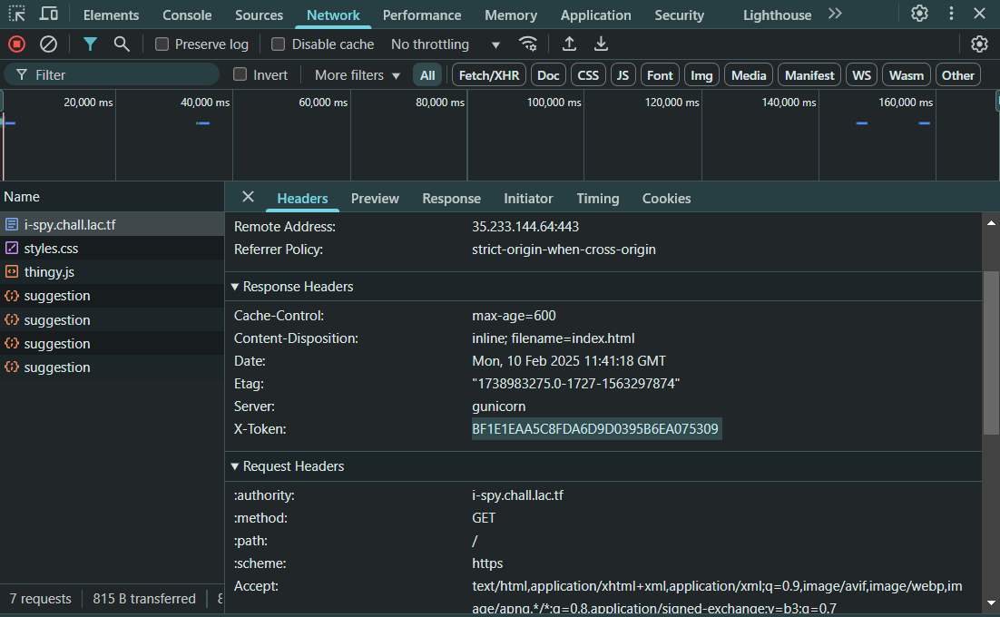

# i spy… - LA CTF Write-up

## 🔍 Challenge Overview


This web challenge presents a textbox that appears to require a token input. Entering the given token results in the message:

> **A token in the HTML source code...**

This suggests that the next token is hidden within the page's source code.

## 🚀 How to Solve

### 1. HTML Source Code


Upon inspecting the source code, a new token is found. Entering this token into the textbox leads to the next message:

> **A token in the JavaScript console...**

### 2. JavaScript Console


Checking the browser's JavaScript console reveals another token. Entering it prompts the message:

> **A token in the stylesheet...**

### 3. Stylesheet (CSS)


Inspecting the website's `style.css` file uncovers the next token. After inputting it, the website responds with:

> **A token in JavaScript code...**

### 4. JavaScript File


Examining `thingy.js` reveals another hidden token. Entering it returns:

> **A token in a header...**

### 5. HTTP Headers



By inspecting the response headers, a field named `X-token` contains the next token. After submitting it, the website prompts:

> **A token in a cookie...**

### 6. Cookies


Checking the request headers reveals a token stored in the cookies. Entering it triggers:

> **A token where the robots are forbidden from visiting...**

### 7. Robots.txt

Checking `/robots.txt` provides a clue:

```
User-agent: *
Disallow: /a-magical-token.txt
```

Navigating to `/a-magical-token.txt` reveals another token.


Entering this token gives:

> **A token where Google is told what pages to visit and index...**

### 8. Sitemap.xml


Opening `/sitemap.xml` reveals another token. Inputting it leads to:

> **A token received when making a DELETE request to this page...**

### 9. DELETE Request


Using Burp Suite to change the request method from `GET` to `DELETE` prompts a response containing the next token. Entering it results in:

> **A token in a TXT record at i-spy.chall.lac.tf...**

### 10. DNS TXT Record


The challenge suggests that a token is stored in a **TXT record** of the domain `i-spy.chall.lac.tf`. DNS TXT records are often used to store metadata, including verification tokens or configurations. To retrieve the token, we use PowerShell with the following command:

```powershell
Resolve-DnsName -Type TXT i-spy.chall.lac.tf
```

This command queries the DNS server for any TXT records associated with the domain, revealing the hidden token.

Entering this token finally reveals the flag!

## Flag

```plaintext
lactf{1_sp0773d_z_t0k3ns_4v3rywh3r3}
```
