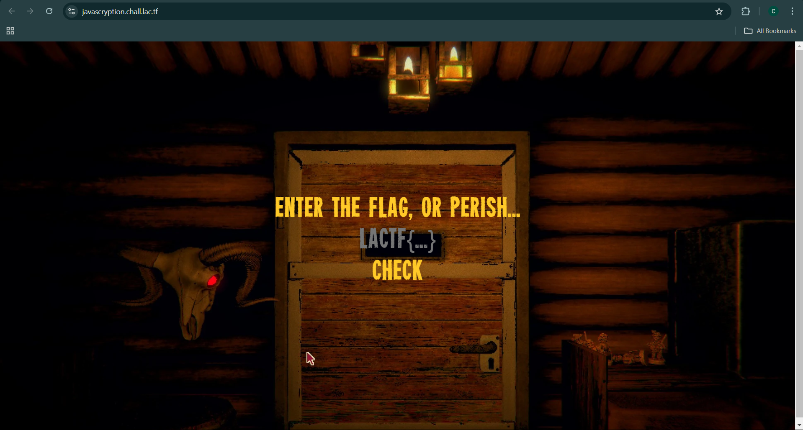
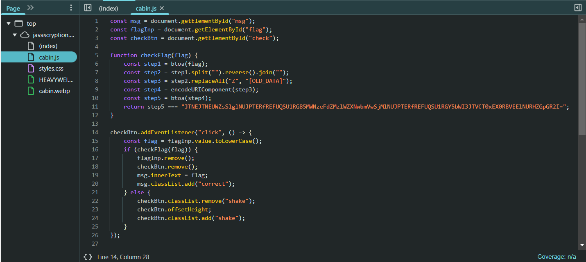

# javascription - LA CTF Writeup

## 🔍 Challenge Overview

This challenge presents a website where you can enter a word and receive a flag in response.



Since we don't know the expected input, I checked the JavaScript code for clues.



## 🚀 How to Solve

### Code Analysis

The JavaScript function `checkFlag(flag)` follows these transformations:
1. **Base64 Encoding** (`btoa(flag)`) - Converts input into a Base64 string.
2. **String Reversal** (`split('').reverse().join('')`) - Reverses the Base64 string.
3. **Character Replacement** (`replaceAll("Z", "[OLD_DATA]")`) - Substitutes `Z` with `"[OLD_DATA]"`.
4. **URL Encoding** (`encodeURIComponent(step3)`) - Applies URL encoding.
5. **Base64 Encoding Again** (`btoa(step4)`) - Encodes the processed string into Base64.
6. Compares the final result with a hardcoded Base64 string.

### Exploitation Strategy

To retrieve the flag, we need to reverse the transformations in the opposite order:
1. **Decode from Base64** (Step 5 Reversed)
2. **Decode URL Encoding** (Step 4 Reversed)
3. **Restore `Z` characters** (Step 3 Reversed)
4. **Reverse the string** (Step 2 Reversed)
5. **Decode from Base64** (Step 1 Reversed)

### Exploit Code

```python
import base64
import urllib.parse

# Encoded string from the JavaScript code
target_encoded = "JTNEJTNEUWZsSlglNUJPTERfREFUQSU1RG85MWNzeFdZMzlWZXNwbmVwSjMlNUJPTERfREFUQSU1RGY5bWI3JTVCT0xEX0RBVEElNURHZGpGR2I="

# Step 5: Decode from Base64
step4 = base64.b64decode(target_encoded).decode()

# Step 4: Decode from URL encoding
step3 = urllib.parse.unquote(step4)

# Step 3: Restore 'Z' characters
step2 = step3.replace("[OLD_DATA]", "Z")

# Step 2: Reverse string order
step1 = step2[::-1]

# Step 1: Decode from Base64 to get the original flag
flag = base64.b64decode(step1).decode()

print(flag)
```

### Flag
```
lactf{no_grizzly_walls_here}
```
