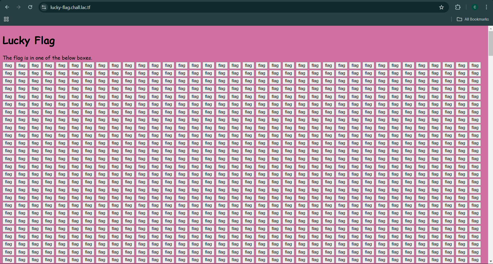

# lucky-flag LA CTF Write-up

## 🔍 Challenge Overview



This challenge consists of a webpage with multiple "flag" buttons, where only one contains the actual flag.

Since checking each button manually was impractical, I inspected the JavaScript code used in this web application.


## 🚀 How to Solve

The JavaScript code reveals that the flag is hidden within one of the buttons and will be displayed if the correct button is clicked. However, the flag string is encrypted using an XOR operation with the value **0x62**.


The encrypted string consists of Unicode escape sequences, which are characters stored in hexadecimal notation. The encryption method used is **XOR (exclusive OR)** with the key `0x62`. XOR is a reversible operation, meaning applying the same XOR key to the encrypted text will retrieve the original text.

### Steps to Decrypt:
1. Convert each Unicode escape sequence into its corresponding character.
2. Apply the XOR operation with `0x62` to each character.
3. Convert the resulting values back into readable text.

## Decryption Script

```python
# Encrypted string
enc_str = "\u000e\u0003\u0001\u0016\u0004\u0019\u0015V\u0011=\u000bU=\u000e\u0017\u0001\t=R\u0010=\u0011\t\u000bSS\u001f"

# Perform XOR with 0x62 to decrypt
decrypted_chars = [chr(ord(c) ^ 0x62) for c in enc_str]
flag = "".join(decrypted_chars)

print(flag)
```

## Flag Found

```plaintext
lactf{w4s_i7_luck_0r_ski11}
```
